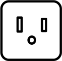
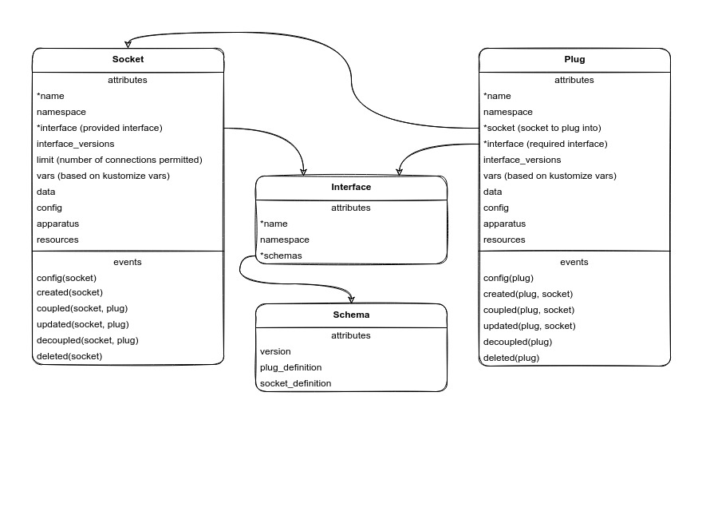

# integration-operator

> kubernetes operator to integrate deployments

Please ★ this repo if you found it useful ★ ★ ★

This operator takes inspiration from [Juju](https://juju.is) [Charm](https://juju.is/docs/sdk)
[Relations](https://juju.is/docs/sdk/relations) by [Canonical](https://canonical.com).

## Terminology

| Term            | Juju Equivalent | Definition                                                                                    |
| --------------- | --------------- | --------------------------------------------------------------------------------------------- |
| Integration     | Relation        | means to unite and connect applications through mutual communication and shared configuration |
| Plug            | Requires        | request from an application to integrate with another application                             |
| Socket          | Provides        | fulfils requests from applications trying to integrate                                        |
| Interface       | Interface       | plug and socket schema required to connect                                                    |
| Created Event   | Created Event   | event triggered when plug or socket created                                                   |
| Updated Event   | Changed Event   | event triggered when plug or socket updated                                                   |
| Coupled Event   | Joined Event    | event triggered when applications connected                                                   |
| Decoupled Event | Detached Event  | event triggered when applications disconnected                                                |

## Architecture

### A simple analogy

The best way to explain the architecture is to think about how plugs and sockets work in the real world.

Let's say I have a laptop purchased in the United States. In order to power my laptop, I need to **integrate** it with the power grid.
Since the laptop was purchased in the United States, the **interface** of the **plug** is Type A as illustrated below.

This means the **socket** I connect to must be also be Type A.

Now, let's say I travel to India and the only **socket** available to me is Type D as illustrated below.

Since the **socket** interface does not match the **plug** interface, I cannot integrate my laptop with the power grid in India. Of course
this can be overcome with converters, but that is beyond the scope of this analogy.

### A real example

Let's say I have an express application that needs to **integrate** with a mongo database. The express deployment will have a **plug** with
a mongo **interface** and the mongo deployment will have a **socket** with a mongo **interface**. If the **interface** of the **socket** is
a postgres **interface** then the integration will fail. In other words, you cannot connect a mongo **plug** to a postgres **socket**. That
would be like trying to plug a US Type A **plug** into an Indian Type D **socket**. You can only connect a mongo **plug** to a mongo **socket**.

### diagram

Below is a UML diagram that shows how **plugs**, **sockets** and **interfaces** wire together.

## TODO

- [ ] prevent double couple from socket
- [ ] test invalid namespace
- [ ] autodeploy apparatus
- [ ] autostart apparatus
- [ ] autoterminate apparatus after idle timeout
